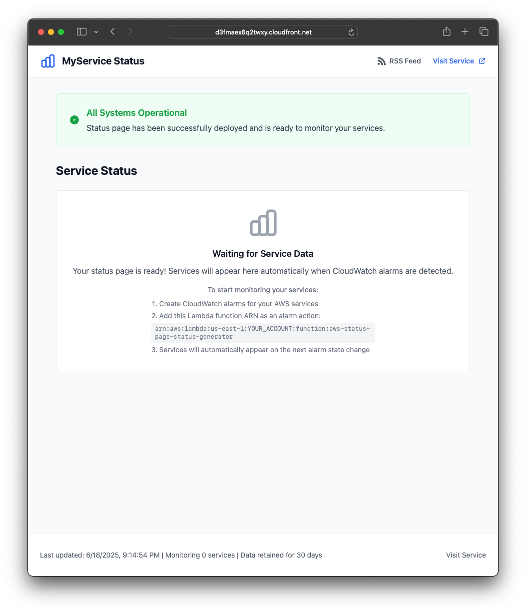
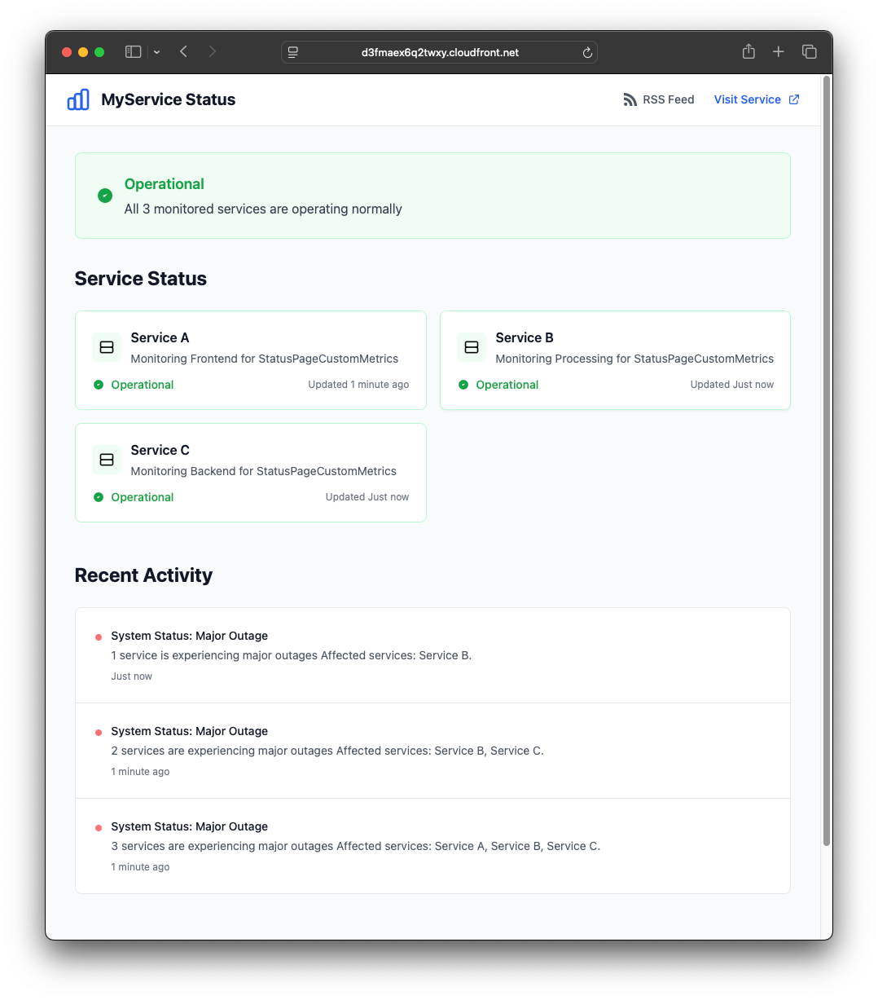
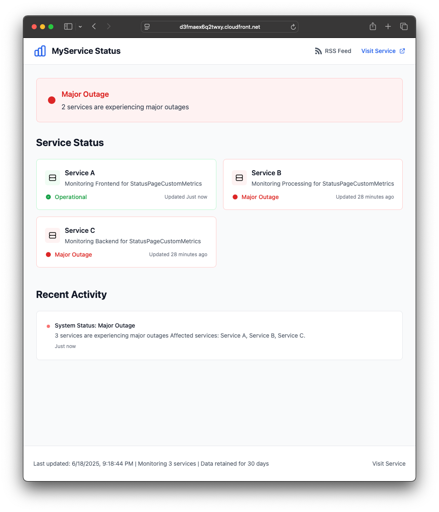

# AWS Service Status Page

[](https://github.com/avaines/s3tree/actions/workflows/main.yml)
[](https://github.com/avaines/aws-status-page/releases)
[](https://github.com/avaines/aws-status-page/blob/main/LICENSE)


A serverless status page application built with AWS SAM that automatically monitors your AWS services and displays their health status in a beautiful, production-ready web interface. Use your existing Cloudwatch composite alarms representing your core service elements to give your user base an insight into the services.

## Architecture Overview

I've written the tool using AWS SAM for deployment and kept it as lean as possible so that conversion to Terraform/OpenTofu is fairly simple.


The status page is essentially serverless with the following AWS services:

- **Lambda Function**: Process alarms, generate status pages and RSS feeds
- **DynamoDB**: Store status history with customisable expiration
- **S3**: Host static status page files and RSS feed
- **CloudFront**: Global CDN for caching
- **SNS**: Email notifications for private status changes
- **EventBridge**: Scheduled status page updates

## Quick Start

### Prerequisites

- AWS CLI configured with appropriate permissions
- SAM CLI installed
- Node.js (for local development)

### Configuration Parameters

When deploying, you can customize these parameters, if you use the `quickstart.sh` wrapper these can all be passed in as runtime arguments:

- `Environment`: Deployment environment (dev, staging, prod)
- `ServiceName`: Name of your service (displayed on the status page)
- `ServiceUrl`: URL of your main service
- `NotificationEmail`: Email address for status change notifications
- `DataRetentionDays`: How long to keep status history (1-365 days, default: 30)
- `EnablePointInTimeRecovery`: Enable DynamoDB PITR (additional cost, default: false)

### Deployment

- **Deploy using the provided script**:
   ```bash
   ./quickstart.sh # See the script docstring for the supported params
   ```

- **Or deploy manually with SAM**:
   ```bash
   sam build
   sam deploy --guided
   ```

## Usage

The status page automatically monitors CloudWatch alarms that have this Lambda function configured as a target action. When an alarm changes state, the Lambda function:

1. **Discovers Services**: Scans CloudWatch alarms that reference the status generator Lambda
2. **Groups by Service**: Organises alarms by service name (extracted from alarm names)
3. **Calculates Status**: Determines overall system status based on alarm states
4. **Generates Content**: Creates and uploads both HTML status page and RSS feed
5. **Invalidates Cache**: Clears CloudFront cache for immediate updates
6. **Stores History**: Saves status data in DynamoDB with TTL
7. **Sends Notifications**: Emails alerts if status changed

### Status Values

- `operational`: Service is working normally
- `degraded`: Service is working but with reduced performance
- `partial_outage`: Some functionality is unavailable
- `major_outage`: Service is completely unavailable
- `maintenance`: Planned maintenance in progress

### Adding Custom Services

To monitor custom services:

1. **Create CloudWatch Alarms** for your services with descriptive names
2. **Add Lambda Function ARN** as an alarm action:
   ```bash
   aws cloudwatch put-metric-alarm \
     --alarm-name "MyApp-HighErrorRate" \
     --alarm-actions "arn:aws:lambda:region:account:function:stack-name-status-generator"
   ```
3. Services should Auto-Appear on the next status page update, either by waiting out the refresh timer or an alarm changing state.

### Alarm Naming Conventions

For best service detection, use these naming patterns:

```bash
# Good custom namespace examples:
"UserAPI-HighErrorRate"        → "UserAPI" service
"PaymentService-DatabaseDown"  → "PaymentService" service
"WebApp-LoadBalancer-5XX"      → "WebApp LoadBalancer" service

# AWS services auto-detected:
"AWS/Lambda" namespace         → "Lambda Functions"
"AWS/ApplicationELB"          → "Application Load Balancer"
"AWS/RDS"                     → "RDS Database"
```

## Troubleshooting

### Status page not updating
1. Check CloudWatch logs for the Lambda function
2. Verify CloudWatch alarms have the Lambda function as an action
3. Check EventBridge scheduled rule is enabled

### No services detected
1. Ensure CloudWatch alarms exist and have the Lambda function ARN as an action
2. Check alarm naming follows recommended patterns
3. Verify Lambda function has CloudWatch permissions
4. Review Lambda logs for alarm processing details

### Email notifications not working
1. Verify the SNS topic subscription is confirmed (check email)
2. Check the email address in the stack parameters
3. Look for SNS delivery failures in CloudWatch
4. Ensure Lambda has SNS publish permissions

### CloudFront not serving latest content
1. The Lambda function automatically invalidates the cache for both HTML and RSS
2. You can manually invalidate using the AWS Console
3. Check the CloudFront distribution configuration
4. Verify S3 bucket policy allows CloudFront access

## Contributing

1. Fork the repository
2. Create a feature branch
3. Make your changes
4. Test thoroughly with `sam local`
5. Update the infrastructure diagram if needed
6. Submit a pull request

## License

This project is licensed under the MIT License - see the LICENSE file for details.

## Support

For issues and questions:
1. Check the troubleshooting section above
2. Review CloudWatch logs for detailed error information
3. Consult the infrastructure diagram for data flow understanding
4. Open an issue on GitHub with logs and configuration details

## Screenshots

**Initial Deployment**


**Healthy Services Example**


**Unstable Services Example**

